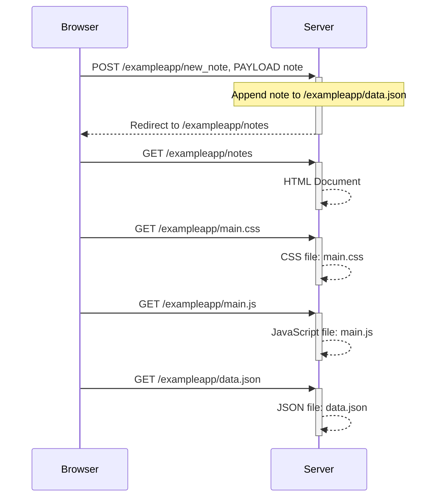

```mermaid
sequenceDiagram;
    participant A as Browser;
    participant B as Server;
    A->>+B: POST /exampleapp/new_note, PAYLOAD note;
    Note over B: Append note to /exampleapp/data.json
    B-->>-A: Redirect to /exampleapp/notes;
    A->>+B: GET /exampleapp/notes
    B-->>-B: HTML Document
    A->>+B: GET /exampleapp/main.css
    B-->>-B: CSS file: main.css
    A->>+B: GET /exampleapp/main.js
    B-->>-B: JavaScript file: main.js
    A->>+B: GET /exampleapp/data.json
    B-->>-B: JSON file: data.json
```
