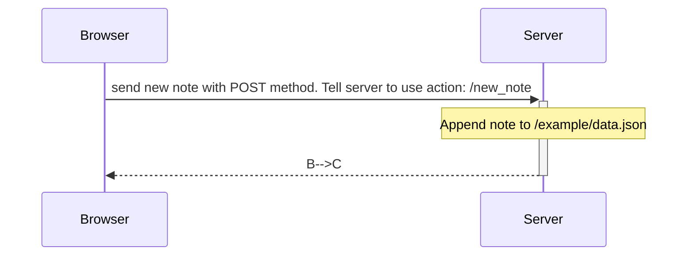

```mermaid
sequenceDiagram;
    participant A as Browser;
    participant B as Server;
    A->>+B: send new note with POST method. Tell server to use action: /new_note;
    Note over B: Append note to /example/data.json
    B-->>-A: B-->C;
```
