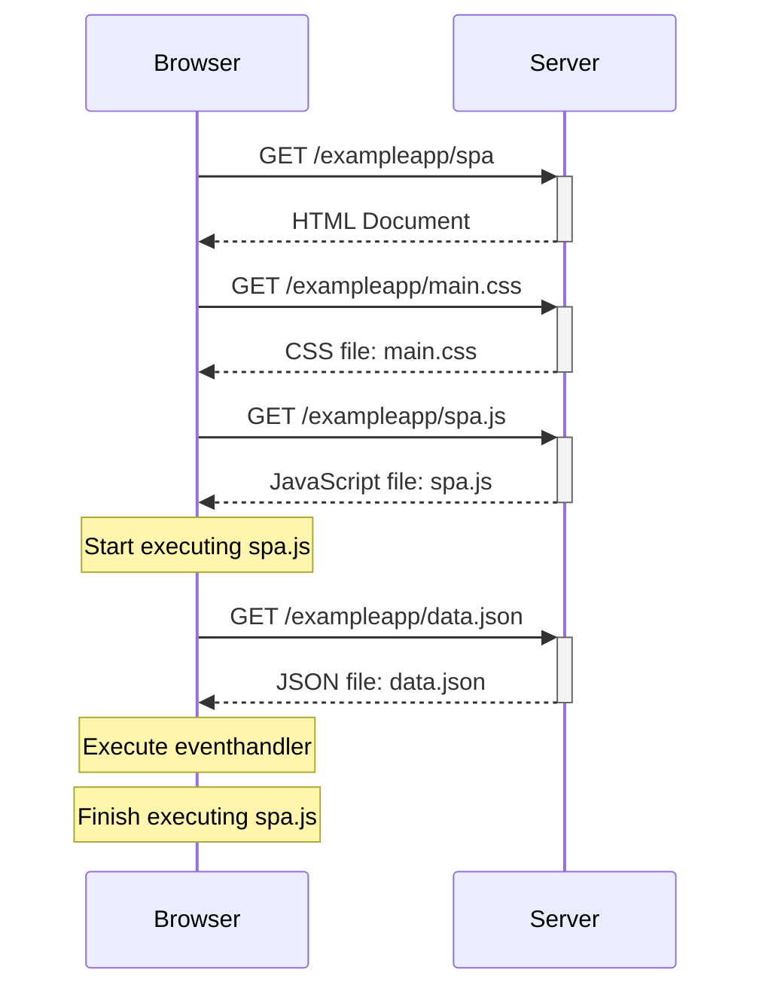

```mermaid
sequenceDiagram;
    participant A as Browser;
    participant B as Server;
    A->>+B: GET /exampleapp/spa
    B-->>-A: HTML Document
    A->>+B: GET /exampleapp/main.css
    B-->>-A: CSS file: main.css
    A->>+B: GET /exampleapp/spa.js
    B-->>-A: JavaScript file: spa.js
    Note over A: Start executing spa.js
    A->>+B: GET /exampleapp/data.json
    B-->>-A: JSON file: data.json
    Note over A: Execute eventhandler
    Note over A: Finish executing spa.js
```
